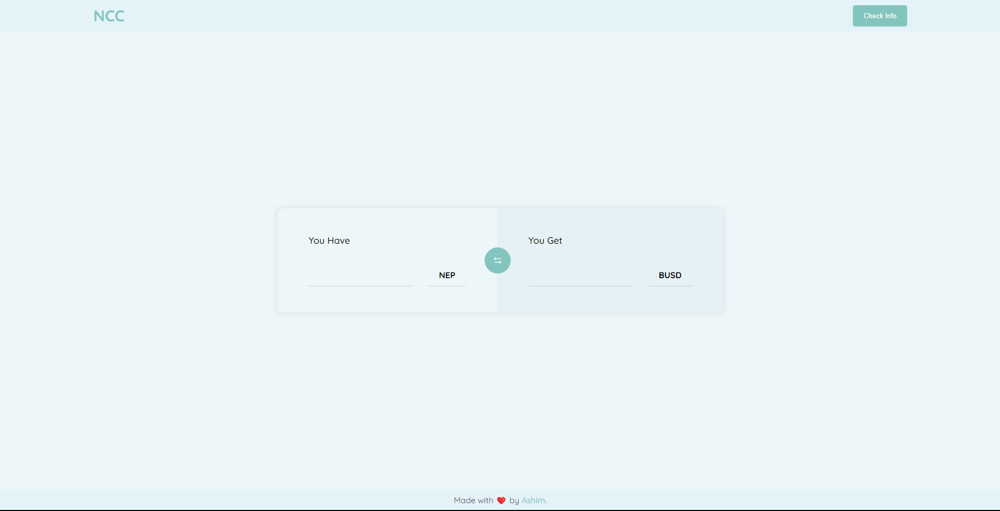
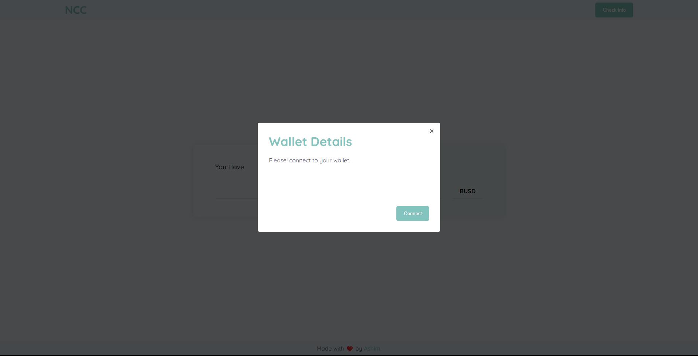

# NCC (Neptune Currency Converter)

Welcome to the NCC (Neptune Currency Converter) project! This repository contains the code for a currency conversion application built using Next.js. The NCC allows users to convert between different currencies quickly and easily.

## Table of Contents

- [Introduction](#introduction)
- [Atomic Design Pattern](#atomic-design-pattern)
- [Installation](#installation)
- [Usage](#usage)

## Introduction

The NCC is a currency converter application designed to provide a simple and intuitive user experience for converting currencies.

## Atomic Design Pattern

The NCC project follows the Atomic Design pattern, which is a methodology for designing and building user interfaces. It emphasizes creating reusable and modular components that can be combined to form larger, more complex interfaces.

Atomic Design consists of five distinct stages:

1. **Atoms**: These are the smallest building blocks of the application, such as buttons, inputs, or icons. Atoms are simple and independent elements that cannot be broken down any further.
2. **Molecules**: Molecules are combinations of atoms that form more complex components. For example, a search bar (molecule) could consist of an input field (atom) and a search button (atom).
3. **Organisms**: Organisms are groups of molecules and atoms that work together to form a section of the user interface. They represent specific sections or features of the application, such as a currency conversion form.
4. **Templates**: Templates define the overall structure and layout of a page or screen. They arrange organisms and establish the overall visual hierarchy.
5. **Pages**: Pages are the final step in the Atomic Design pattern. They are specific instances of templates that include actual content and represent the full user interface.

By following the Atomic Design pattern, the NCC project promotes code reusability, maintainability, and scalability. It allows for a consistent and modular approach to building the user interface.

## Installation

To run the NCC project locally, please follow these steps:

1. Clone the repository to your local machine using the following command:
   `git clone https://github.com/ashim-bhatta/NCC.git`

2. Navigate to the project directory:
   `cd NCC`

3. Install the project dependencies using npm or yarn:
   `yarn` or `yarn install`

## Usage

To run the NCC project locally, execute the following command:
`npm run dev`

This command starts the development server and allows you to access the NCC application in your browser. Simply open your preferred browser and visit `http://localhost:3000` to use the application.

## Hosted Version
